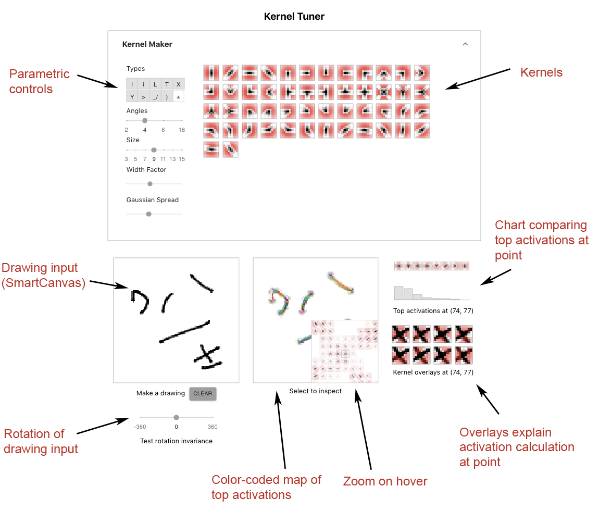
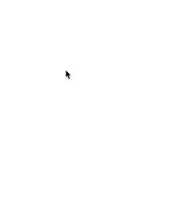
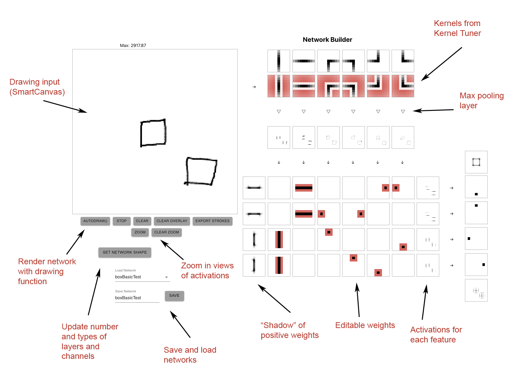
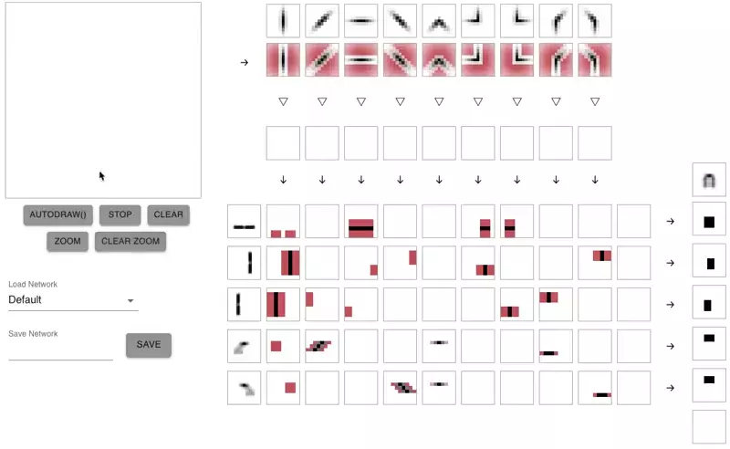
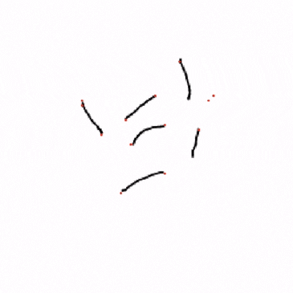
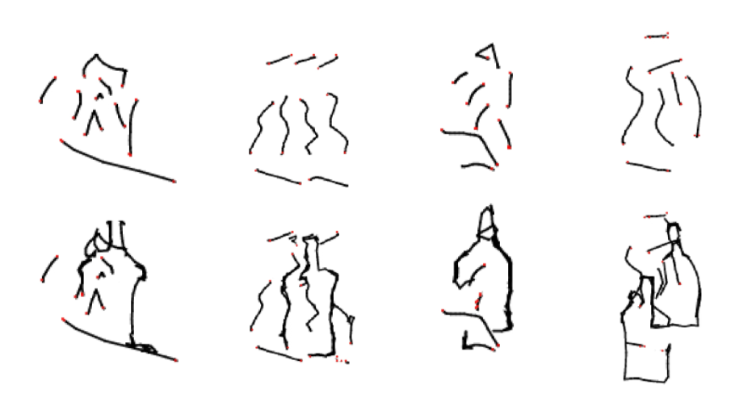
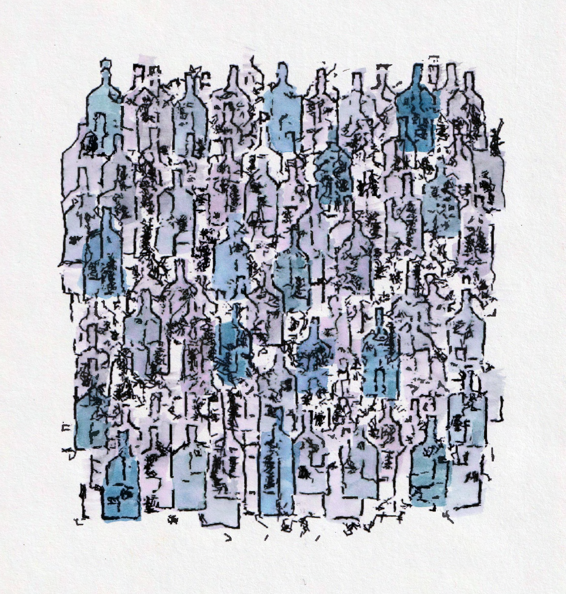

# Hand-Crafting Neural Networks for Art-Making
**By: Erik Ulberg**

*Part of a thesis in partial fulfillment of the requirements for the degree of [Master of Science in Computational Design](https://soa.cmu.edu/mscd) degree at Carnegie Mellon University*

This thesis presents a series of web tools for directly crafting the weights of convolutional neural networks (CNNs) to make line drawings. The goal is to make art and to better understand how CNNs encode visual concepts. The tools developed as part of this work are called the Kernel Tuner and the Network Builder. They combine an editable canvas, interactive visualizations, and the hand-crafting of weights. 

## Kernel Tuner

The Kernel Tuner is a parametric tool for crafting a single layer of weights to extract basic features from a line drawing.

### Diagram

### Controls

Inspired by Gabor filters and early CV work, kernels are generated using a Gaussian function and a sine wave. They detect different types of interesting features in a line drawing such as lines, line ends, corners, T, X and Y-intersections.

### Use

Generally, the process of using the Kernel Tuner begins by making a drawing on the canvas to serve as the basis for evaluating sets of parameters. Next, the sliders within the user interface are used to rapidly test different parameters. The canvas can also be rotated to see how tolerant the kernels are to variance. While these updates are made, the Kernel Tuner provides real time visualizations of how the network responds. Through this iterative process, the tool facilitates human-led jumps through the search space of possible kernels.

")

### A line end detector designed with the Kernel Tuner

The Kernel Tuner was used to produce a set of weights for a line end detector for the drawing system. After about an hour of experimentation, a set of eight kernels of five pixels across was chosen. Fewer and smaller kernels minimized the number of calculations performed during convolution and thus allowed the algorithm to operate more efficiently. Since the detector did not have to be perfect, these kernels were an attractive balance between speed and accuracy. It is important to note that the eight kernels produced were not a one-size fits all solution for detecting line ends in images. Instead, they were a solution for a particular creative project with a certain type of image.

## Network Builder

The Network Builder uses the kernels from the Kernel Tuner as its first layer and assists with the more ambitious goal of hand-crafting multiple layers of convolutionand pooling. Since explanation becomes more difficult withmultiple layers, the Network Builder also offers opportunities for understanding the network’s function through observation. It achieves this by plugging in the network as areward function for a generative line drawing system.

### Diagram

### Use

Typically, the process of using the Network Builder starts with the manual entry of kernel weights (with the help of functions for rotation, reflection, and shifting). Then, the generative algorithm is run to produce several sample outputs to evaluate the success of the weights. If the samples do not match expectations, the generative algorithm is run again until it reproduces an aspect that is not intended (such as premature stopping). The algorithm can be paused to allow the user to draw and erase on the canvas while observing changes in network activations. This helps to explain why the final activation score is not responding as expected. Following inspection of the network activations, the steps are repeated. This crafting process involves both observation (of the generative system's response to a given canvas state) and explanation (through the tracing of network weights).

")

## Generative line drawing system

The line drawing system operates iteratively on the current state of a canvas by drawing or erasing marks of a few pixels in length. The algorithm has two options: it can start a new line or continue a line it is already drawing. Either way, it generates batches of random segments, tests how each segment changes the activation score, and then chooses the highest score. Through this method, the algorithm greedily maximizes the activation of the network. The system terminates when it can no longer find segments that sufficiently improve the activation score (based on a tuned threshold). Additionally, it uses a line end detector to inject options that connect to existing line ends. This small modification makes the system much more likely to draw meaningful shapes.

### Completing bottles from random human input

### Conceptual artwork

Multiple versions of the generative system maximizing different parts of the bottle-detecting network (starting from the lower layers and moving up) were run. The artistic process involved writing small programs for running the generative algorithm as well as tweaking thresholds and parameters within the algorithm (such as the ratio of drawing to erasing or when to halt).

#### Printing out and hand painting the result.

---

## Create React App

This project was bootstrapped with [Create React App](https://github.com/facebook/create-react-app).

## Available Scripts

In the project directory, you can run:

### `yarn start`

Runs the app in the development mode. 
Open [http://localhost:3000](http://localhost:3000) to view it in the browser.

The page will reload if you make edits. 
You will also see any lint errors in the console.

### `yarn test`

Launches the test runner in the interactive watch mode. 
See the section about [running tests](https://facebook.github.io/create-react-app/docs/running-tests) for more information.

### `yarn build`

Builds the app for production to the `docs` folder. 
It correctly bundles React in production mode and optimizes the build for the best performance.

The build is minified and the filenames include the hashes. 
Your app is ready to be deployed!

See the section about [deployment](https://facebook.github.io/create-react-app/docs/deployment) for more information.

### `yarn eject`

**Note: this is a one-way operation. Once you `eject`, you can’t go back!**

If you aren’t satisfied with the build tool and configuration choices, you can `eject` at any time. This command will remove the single build dependency from your project.

Instead, it will copy all the configuration files and the transitive dependencies (Webpack, Babel, ESLint, etc) right into your project so you have full control over them. All of the commands except `eject` will still work, but they will point to the copied scripts so you can tweak them. At this point you’re on your own.

You don’t have to ever use `eject`. The curated feature set is suitable for small and middle deployments, and you shouldn’t feel obligated to use this feature. However we understand that this tool wouldn’t be useful if you couldn’t customize it when you are ready for it.

## Learn More

You can learn more in the [Create React App documentation](https://facebook.github.io/create-react-app/docs/getting-started).

To learn React, check out the [React documentation](https://reactjs.org/).

### Code Splitting

This section has moved here: https://facebook.github.io/create-react-app/docs/code-splitting

### Analyzing the Bundle Size

This section has moved here: https://facebook.github.io/create-react-app/docs/analyzing-the-bundle-size

### Making a Progressive Web App

This section has moved here: https://facebook.github.io/create-react-app/docs/making-a-progressive-web-app

### Advanced Configuration

This section has moved here: https://facebook.github.io/create-react-app/docs/advanced-configuration

### Deployment

This section has moved here: https://facebook.github.io/create-react-app/docs/deployment

### `yarn build` fails to minify

This section has moved here: https://facebook.github.io/create-react-app/docs/troubleshooting#npm-run-build-fails-to-minify
