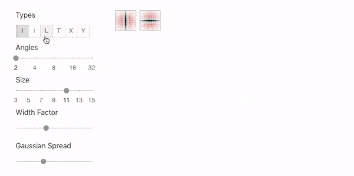
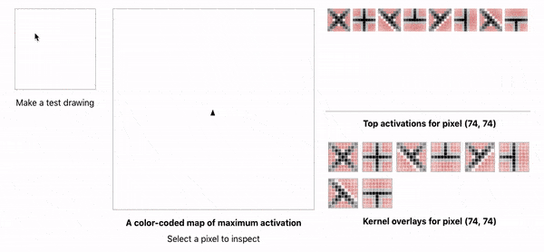

# Crafting the Weights of a CNN to Make a Line Drawing
**By: Erik Ulberg**

For a complete description of the project, see [https://www.erikulberg.com/#/thesis](https://www.erikulberg.com/#/thesis)

*Part of a thesis in partial fulfillment of the requirements for the degree of [Master of Science in Computational Design](https://soa.cmu.edu/mscd) degree at Carnegie Mellon University*

This thesis presents a series of web tools for directly crafting the weights of convolutional neural networks (CNNs) to make line drawings. The goal is to make art and to better understand how CNNs encode visual concepts.

## Kernel Tuner

The kernel tuner is a parametric tool for creating kernels for the first convolutional layer. Inspired by Gabor filters and early CV work, kernels are generated using a Gaussian function and a sine wave. They detect different types of interesting features in a line drawing such as lines, line ends, corners, T, X and Y-intersections.

## Kernel Inspector

The inspector tool is useful for diagnosing how kernels interact with line drawings. After making a drawing, users can see the top activation at a given point in a color-coded map. When they select a point, a chart shows the top activations at the point and the kernels are displayed as overlays to demonstrate how they are being activated. The inspector can be used simultaneously with the tuner for fine-grained adjusting.

## Network Builder (*In Progress*)

The above tools provide the first convolutional layer that translates from pixels to a higher level of abstraction: line drawing features. Users build networks on top of this foundation to make line drawings. 

---

## Create React App

This project was bootstrapped with [Create React App](https://github.com/facebook/create-react-app).

## Available Scripts

In the project directory, you can run:

### `yarn start`

Runs the app in the development mode. 
Open [http://localhost:3000](http://localhost:3000) to view it in the browser.

The page will reload if you make edits. 
You will also see any lint errors in the console.

### `yarn test`

Launches the test runner in the interactive watch mode. 
See the section about [running tests](https://facebook.github.io/create-react-app/docs/running-tests) for more information.

### `yarn build`

Builds the app for production to the `docs` folder. 
It correctly bundles React in production mode and optimizes the build for the best performance.

The build is minified and the filenames include the hashes. 
Your app is ready to be deployed!

See the section about [deployment](https://facebook.github.io/create-react-app/docs/deployment) for more information.

### `yarn eject`

**Note: this is a one-way operation. Once you `eject`, you can’t go back!**

If you aren’t satisfied with the build tool and configuration choices, you can `eject` at any time. This command will remove the single build dependency from your project.

Instead, it will copy all the configuration files and the transitive dependencies (Webpack, Babel, ESLint, etc) right into your project so you have full control over them. All of the commands except `eject` will still work, but they will point to the copied scripts so you can tweak them. At this point you’re on your own.

You don’t have to ever use `eject`. The curated feature set is suitable for small and middle deployments, and you shouldn’t feel obligated to use this feature. However we understand that this tool wouldn’t be useful if you couldn’t customize it when you are ready for it.

## Learn More

You can learn more in the [Create React App documentation](https://facebook.github.io/create-react-app/docs/getting-started).

To learn React, check out the [React documentation](https://reactjs.org/).

### Code Splitting

This section has moved here: https://facebook.github.io/create-react-app/docs/code-splitting

### Analyzing the Bundle Size

This section has moved here: https://facebook.github.io/create-react-app/docs/analyzing-the-bundle-size

### Making a Progressive Web App

This section has moved here: https://facebook.github.io/create-react-app/docs/making-a-progressive-web-app

### Advanced Configuration

This section has moved here: https://facebook.github.io/create-react-app/docs/advanced-configuration

### Deployment

This section has moved here: https://facebook.github.io/create-react-app/docs/deployment

### `yarn build` fails to minify

This section has moved here: https://facebook.github.io/create-react-app/docs/troubleshooting#npm-run-build-fails-to-minify
